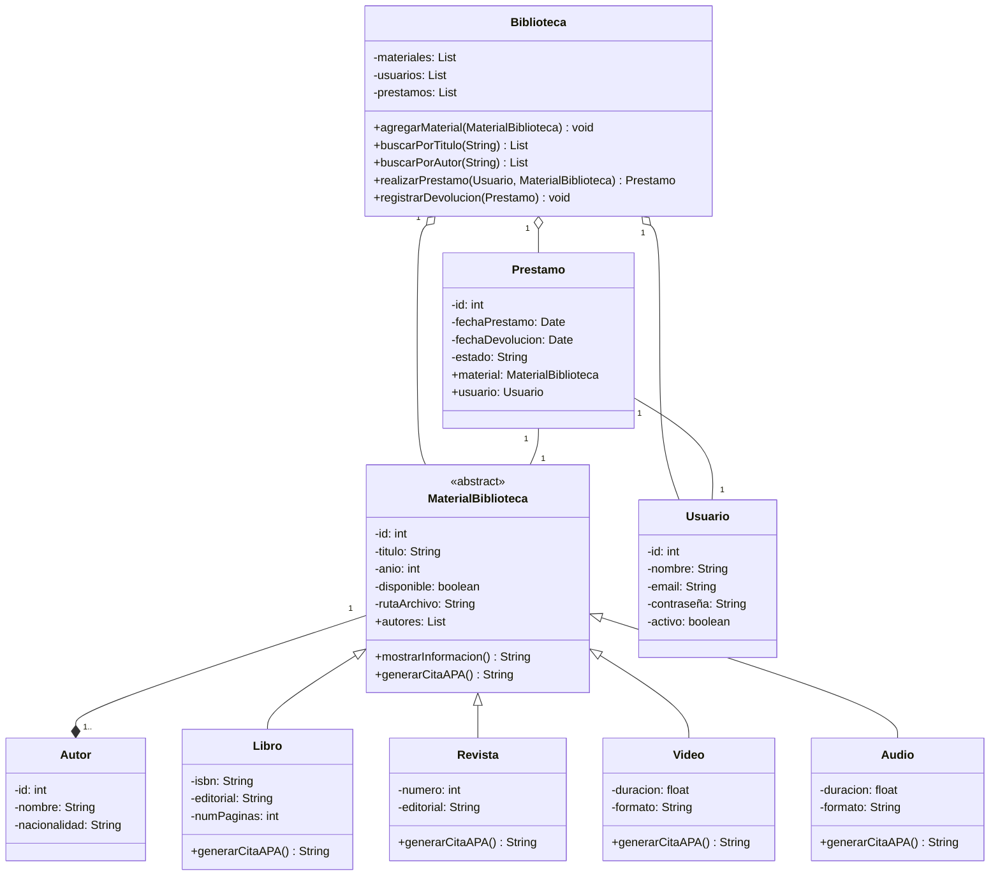
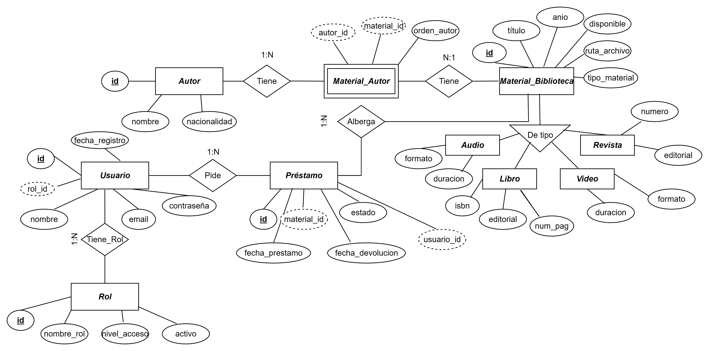
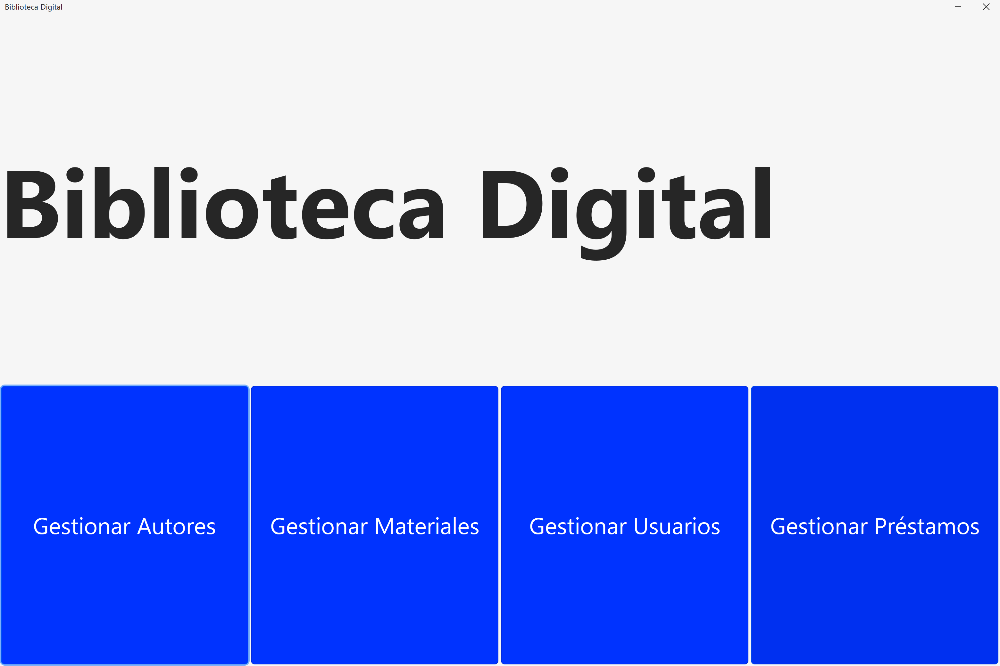

# Biblioteca Digital

## Introducción
Con el avance de la tecnología, las bibliotecas tradicionales han experimentado una transformación significativa, migrando progresivamente hacia entornos digitales. Este cambio plantea retos importantes, entre ellos la necesidad de implementar herramientas que garanticen una interacción eficiente, intuitiva y accesible para los usuarios. En este contexto, el presente documento expone el desarrollo del proyecto “Sistema de Biblioteca Digital”, el cual propone una solución innovadora y actualizada que redefine la gestión y el acceso a la información en bibliotecas digitales.
A lo largo del documento se describen las fases de desarrollo que estructuran el proyecto, estableciendo una base sólida y organizada que permite su implementación a gran escala.

## Planteamiento del problema


Una universidad quiere y necesita desarrollar un sistema de biblioteca digital que le permita gestionar diferentes tipos de materiales como libros, revistas, videos educativos y artículos académicos.
Cada material tiene información común (título, autor, año de publicación) pero también características particulares según su tipo (número de páginas, duración en minutos, volumen y número de edición).
El sistema deberá permitir consultar información de los materiales y mostrar detalles de manera polimórfica (el método se comporta diferente según el tipo de material). También se requiere la gestión de préstamos y devoluciones, así como, la interfaz de búsqueda para localizar material según su título o autor.
Requisitos
- Abstracción: Clase abstracta MaterialBiblioteca.
- Herencia: Libro, Revista, Videos heredan de MaterialBiblioteca.
- Polimorfismo: el método mostrarInformacion() se comporta diferente según el tipo de material.
- Clase abstracta: MaterialBiblioteca.
- Interfaz: Prestamo, implementada por Libro y Revista.

## Metodología de Desarrollo
### 1. Descubrimiento / Empatía / Investigación (Divergencia)
   
  - Contexto detectado: La mayoría de herramientas de gestión de bibliotecas están orientadas a entornos físicos, lo que genera limitaciones cuando se busca un enfoque totalmente digital:
    - Dificultad para organizar y gestionar archivos en múltiples formatos.
    - Soluciones disponibles centradas en préstamos físicos y catálogos impresos.
    - Escasez de software minimalista para bibliotecas digitales comunitarias o educativas.
  - Necesidades de los usuarios:
    - Lectores que buscan una interfaz sencilla de búsqueda y acceso al contenido.
    - Administradores que necesitan organizar y clasificar materiales digitales de manera eficiente.
    - Comunidad open source interesada en disponer de una plataforma extensible para documentación, manuales y archivos multimedia.
  Hallazgos clave:
    - Carencia de herramientas que integren organización de materiales y exportación de referencias.
    - Creciente demanda de soluciones simples que gestionen textos, videos y audios en un solo entorno.
    - Interés en bibliotecas digitales como espacios de acceso libre y colaborativo.
    
### 2. Definición / Síntesis (Divergencia)
  - Problema a resolver: "Actualmente no existe una herramienta de gestión de bibliotecas digitales que sea open source, simple, capaz de manejar distintos formatos de archivo (.pdf, .mp4, .mp3), con almacenamiento estructurado y que genere automáticamente citas bibliográficas de su propio contenido."
  - Oportunidad de mercado:
    - Desarrollar una solución ligera y extensible que sirva de base para proyectos de bibliotecas digitales.
    - Priorizar la experiencia de usuario con búsquedas rápidas, intuitivas y categorización clara.
    - Incorporar, de manera modular, un sistema de exportación de referencias bibliográficas en distintos estilos (APA, MLA, IEEE).

### 3. Ideación (Divergencia y Convergencia)
   
  - Lluvia de ideas de funciones iniciales:
    - Abstracción de clases: usuarios, materiales (libros, videos, audios), préstamos digitales (acceso temporal).
    - Módulo de exportación de referencias en diferentes estilos.
    - Buscador por metadatos (autor, título, año, palabras clave).
    - Sistema de categorización por etiquetas o colecciones.
    - Interfaz web minimalista para lectores y panel de administración para gestores.
    - Posibilidad de integrarse con repositorios académicos externos.
       
  - Selección para primera versión:
    - Gestión básica de usuarios y materiales.
    - Carga y almacenamiento de archivos digitales con metadatos.
    - Búsqueda simple por título y autor.
    - Exportación de citas en formato APA.
    - Documentación clara para la comunidad open source.
      
### 4. Implementación / Construcción (Divergencia y Convergencia)

  - Primera iteración (v0.1):
    - Diagrama de Clases, base de datos con usuarios y materiales digitales.
    - Interfaz web minimalista con login y búsqueda básica.
    - Carga de archivos PDF con metadatos asociados.
    - Exportación de citas en formato APA.
  
  - Pruebas y feedback:
    - Compartir prototipo con estudiantes, docentes y gestores de bibliotecas.
    - Validar facilidad de uso en la búsqueda y carga de archivos.
    - Ajustar interfaz y flujo según retroalimentación.
  
  - Iteraciones siguientes:
    - Soporte para más formatos (.mp4, .mp3).
    - Exportación de referencias en estilos MLA e IEEE.
    - Sistema de categorización avanzada (etiquetas, colecciones temáticas).
    - Préstamos digitales temporales (descargas limitadas).
    - Integración con APIs de repositorios académicos.

Aquí puedes colocar enlaces a los archivos más detallados:
- [Design Thinking aplicado a BibliotecaDigital](./docs/DesignThinking.md)
- [Learn Startup aplicado a BibliotecaDigital](./docs/LearnStartup.md)
- [Scrum aplicado a BibliotecaDigital](./docs/Scrum.md)
- [Product Backlog – BibliotecaDigital: Historias de Usuario y Epicas](./docs/ProductBacklog.md)
---

## Arquitectura del Proyecto
El sistema de Biblioteca Digital, desarrollado en Java (NetBeans) con conexión a MySQL, adopta una arquitectura Cliente–Servidor en 3 capas combinada con el patrón de diseño Modelo–Vista–Controlador (MVC).

**Arquitectura en 3 capas**

1. Capa de Presentación (Cliente / Interfaz de Usuario)
    - Implementada en Java (Swing/JavaFX).
    - Permite al usuario interactuar con el sistema mediante botones y formularios que permiten:
        - Autores.
        - Usuarios.
        - Préstamos.
        - Materiales.
    - Internamente esta capa se estructura bajo el patrón MVC:
        - Vista: formularios, ventanas y paneles gráficos.
        - Controlador: clases que reciben la acción del usuario (clic en botón) y la traducen en una solicitud hacia la lógica.
        - Modelo: clases que representan entidades (Usuario, Autor, Libro, Préstamo) y que se relacionan con la base de datos.
2. Capa de Lógica de Negocio (Servidor / Aplicación)
    - Gestiona las reglas del negocio: validación de disponibilidad de libros, restricción de préstamos, control de fechas y gestión de usuarios.
    - Está implementada en Java (POO) y se comunica con el controlador para ejecutar operaciones.
3. Capa de Datos (Base de Datos)
    - Implementada en MySQL.
    - Almacena y gestiona información de usuarios, autores, libros y préstamos.
    - La interacción con la lógica de negocio se realiza mediante JDBC, utilizando consultas SQL.

**Flujo de Interacción**

1. El usuario interactúa con la Vista (interfaz gráfica).
2. La acción es recibida por el Controlador, que valida la entrada y solicita a la capa de lógica la operación correspondiente.
3. El Modelo representa las entidades y coordina con la capa de datos para realizar consultas o actualizaciones.
4. Los resultados retornan al Controlador, que actualiza la Vista para mostrarlos al usuario.
---

### Diagrama UML de clases


---

### Diagrama E-R

---

## Tecnologías y Especificaciones
Antes de ejecutar el proyecto asegúrate de contar con el siguiente entorno:

* Editor: Apache NetBeans IDE 19
* Lenguaje: Java (JDK 23)
* Base de datos: MySQL Workbench
* Sistema Operativo: Windows 11

  También es necesario tener instalado **Git** para clonar el repositorio.
---

## Ejecucion del Proyecto

1. Clonar el repositorio
  Primero descarga el código fuente del proyecto desde GitHub, ejecuta en terminal o línea de comandos Git:
    ```
    git clone https://github.com/jangelmm/BibliotecaDigital.git
    ```
    Esto creará una carpeta llamada *BibliotecaDigital* en tu computadora.

2. Importar el proyecto en NetBeans

3. Configurar la base de datos
    - Iniciar tu servidor MySQL
    - Crear la base de datos:
      ```
      CREATE DATABASE biblioteca_db;
      ```
      **Nota:** No es necesario importar un script adicional para las tablas, ya que estas se crean automáticamente al ejecutar el proyecto gracias a la configuración de JPA/Hibernate.
    - Abrir el archivo *persistence.xml* del proyecto y editar los datos de conexión:
      ```
      <property name="javax.persistence.jdbc.url" value="jdbc:mysql://localhost:3306/biblioteca_db"/>
      <property name="javax.persistence.jdbc.user" value="root"/>
      <property name="javax.persistence.jdbc.password" value="password"/>
      <property name="javax.persistence.jdbc.driver" value="com.mysql.cj.jdbc.Driver"/>
      ```
      Sustituye ```password``` por la contraseña de tu usuario MySQL (por defecto suele ser root).

4. Ejecutar la aplicación
    - En NetBeans, selecciona el proyecto BibliotecaDigital.
    - Haz clic en **Run Project** (o presiona Shift + F6).
    - La aplicación iniciará y se conectará automáticamente a la base de datos configurada.

      ¡Listo ya puedes usar ***Biblioteca Digital***!

      
---

# Conclusiones
El proceso de desarrollo permitió aplicar de manera efectiva la evaluación de las historias de usuario, lo que facilitó una adaptación adecuada a las condiciones y requerimientos del proyecto. Como resultado, se logró un avance significativo en la creación de un sistema integral capaz de gestionar diversos tipos de archivos en una biblioteca digital. Este sistema, que inicialmente se centraba en documentos PDFs, se ha expandido exitosamente para incluir también audios y videos, consolidándose como una solución versátil y de alto impacto.