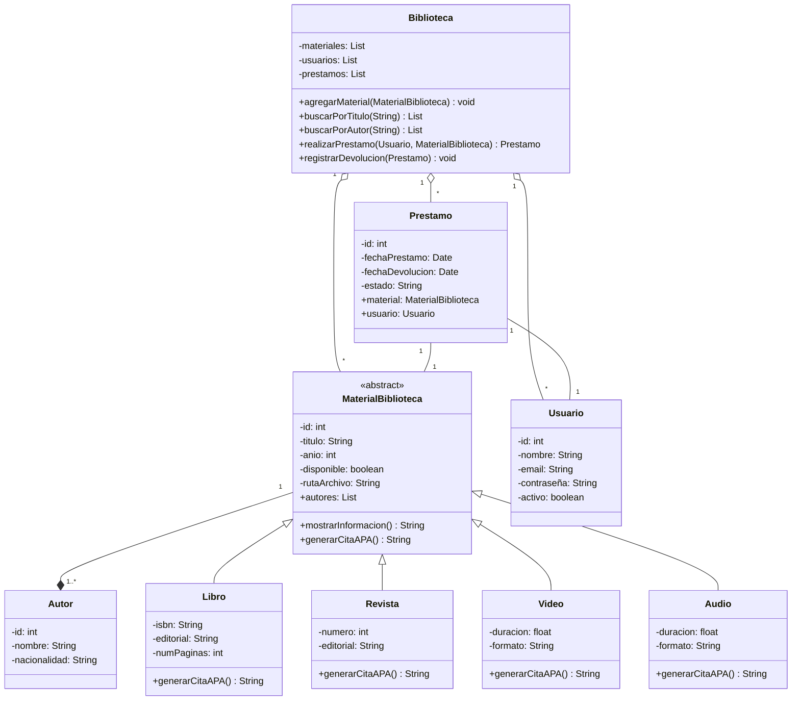

# **Scrum aplicado a BibliotecaDigital**

* Proyecto: **BibliotecaDigital**
* Tecnología: **Java (con patrones de diseño)**
* Metodología: **Scrum**
* Equipo: **1 Product Owner (PO), 1 Scrum Master (SM), 4 Desarrolladores (Dev Team)**

---

## **Pre-Sprint 0: Preparación y Product Backlog Inicial (Día 1 - 3)**

**Actividad principal:**
* Definir alcance del MVP basado en el nuevo diagrama de clases.
* Crear repositorio en GitHub y configurar compilación, pruebas e Issues.
* Configurar entorno de desarrollo con las dependencias necesarias.

### Product Backlog inicial (priorizado) - Actualizado:

1. **HU1**: Como administrador, quiero registrar materiales (libros, revistas, videos, audios) con sus datos básicos y ruta de archivo.
2. **HU2**: Como usuario, quiero buscar materiales por título o autor.
3. **HU3**: Como usuario, quiero pedir prestado un material digitalmente.
4. **HU4**: Como usuario, quiero devolver un material prestado.
5. **HU5**: Como administrador, quiero listar todos los materiales de la biblioteca con su estado.
6. **HU6**: Como administrador, quiero generar citas en formato APA de los materiales cargados.
7. **HU7**: Como usuario, quiero ver información detallada de cada material.
8. **HU8**: Como desarrollador, quiero tener pruebas unitarias de las operaciones básicas de la biblioteca.
9. **HU9**: Como usuario, quiero autenticarme en el sistema con email y contraseña.

---


### Diseño Estático Inicial

* Lenguaje: Java
* Arquitectura: Modelo Vista Controlador (MVC) con patrones de diseño para extensibilidad.

**Diagrama de Clases Inicial (MVP)**



---

## **Estructura del Proyecto**

```
src/
├── main/
│   ├── java/
│   │   └── com/
│   │       └── bibliotecadigital/
│   │           ├── domain/
│   │           │   ├── model/
│   │           │   │   ├── MaterialBiblioteca.java
│   │           │   │   ├── Libro.java
│   │           │   │   ├── Revista.java
│   │           │   │   ├── Video.java
│   │           │   │   ├── Audio.java
│   │           │   │   └── Autor.java
│   │           │   └── service/
│   │           │       └── BibliotecaService.java
│   │           ├── infrastructure/
│   │           │   └── persistence/
│   │           │       └── InMemoryBibliotecaRepository.java
│   │           └── presentation/
│   │               └── desktop/
│   │                   └── controllers/
│   │                       └── MaterialController.java
│   └── resources/
└── test/
    └── java/
        └── com/
            └── bibliotecadigital/
                └── domain/
                    └── service/
                        └── BibliotecaServiceTest.java
```

## **Plan de Sprints con Equipo de 4 Desarrolladores - Actualizado**

### Sprint 1 (2 semanas)

**Objetivo**: Implementar gestión básica de materiales, autores y usuarios con autenticación.
**Historias seleccionadas**: HU1, HU2, HU5, HU9.

**Asignación de tareas:**
* Dev1: Implementar clases `MaterialBiblioteca`, `Libro`, `Revista`, `Video`, `Audio` con atributos incluyendo `rutaArchivo`.
* Dev2: Implementar clase `Autor` y relación muchos-a-muchos con materiales.
* Dev3: Implementar clase `Biblioteca` con `agregarMaterial`, `listarMateriales`, `buscarPorTitulo`, `buscarPorAutor`.
* Dev4: Implementar clase `Usuario` con autenticación (email y contraseña).

**Entregable**: Versión v0.1 con registro de materiales, búsqueda por título/autor, listado y autenticación de usuarios.

---

### Sprint 2 (2 semanas)

**Objetivo**: Agregar funcionalidad completa de préstamos y devoluciones.
**Historias seleccionadas**: HU3, HU4, HU7.

**Asignación de tareas:**
* Dev1: Implementar clase `Prestamo` con fechas y estado.
* Dev2: Implementar métodos en `Biblioteca` para `realizarPrestamo` y `registrarDevolucion` con control de disponibilidad.
* Dev3: Implementar método `mostrarInformacion` en todas las subclases de material.
* Dev4: Implementar lógica de límite de préstamos por usuario y validaciones.

**Entregable**: v0.2 con sistema completo de préstamos, devoluciones y visualización detallada de materiales.

---

### Sprint 3 (2 semanas)

**Objetivo**: Incorporar exportación de citas APA y pruebas unitarias completas.
**Historias seleccionadas**: HU6, HU8.

**Asignación de tareas:**
* Dev1: Implementar método `generarCitaAPA` en todas las subclases de material con formatos específicos.
* Dev2: Configurar JUnit y escribir pruebas para clases de dominio (`MaterialBiblioteca`, `Autor`, `Usuario`).
* Dev3: Pruebas para lógica de préstamos y devoluciones.
* Dev4: Pruebas para generación de citas y documentación técnica.

**Entregable**: v0.3 con generación de citas APA, pruebas unitarias completas y documentación.

---

### Herramientas de Seguimiento

* **GitHub Projects**: tablero Kanban (To do / In progress / Done) con las nuevas historias.
* **GitHub Issues**: cada HU registrada como issue con etiquetas actualizadas.
* **GitHub Actions**: CI/CD configurado para ejecutar pruebas automáticamente.
* **GitHub Releases**: publicar entregables de cada sprint con changelog.
---

### Notas importantes sobre la actualización:

1. Se añadió **HU9** para autenticación de usuarios, necesaria para el sistema de préstamos.
2. El **Sprint 1** ahora incluye la implementación de la clase `Audio` y el atributo `rutaArchivo`.
3. El **Sprint 2** se centra en la clase `Prestamo` independiente y la gestión completa de préstamos.
4. El **Sprint 3** incluye la implementación de `generarCitaAPA()` en todas las subclases de material.
5. Se enfatiza la importancia de las pruebas unitarias para todas las funcionalidades implementadas.

### Herramientas y Versiones
- Editor: **Apache NetBeans IDE 19**
- Java: **JDK 23 (Default)**
- SO: **Windows 11**