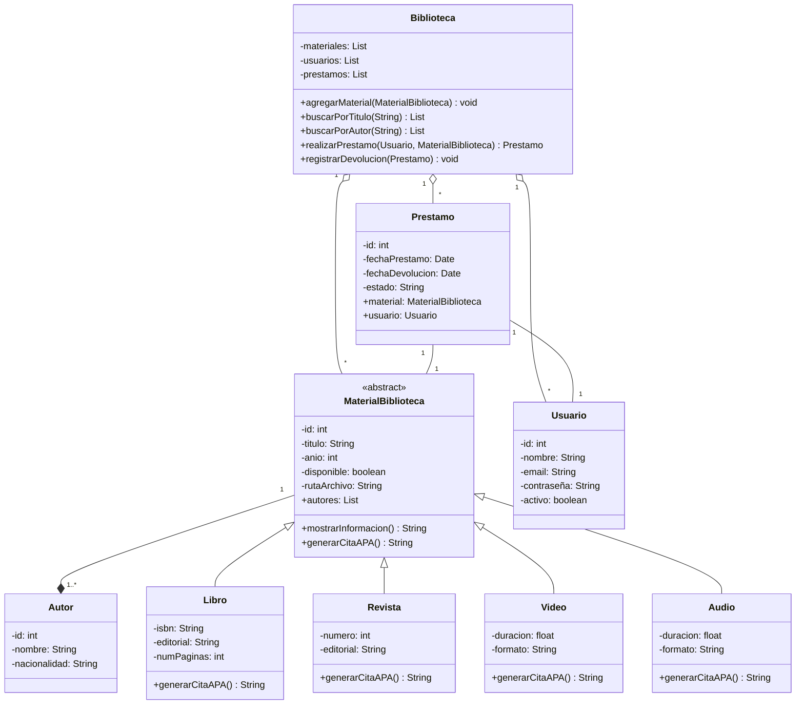

# **Scrum aplicado a BibliotecaDigital**

* Proyecto: **BibliotecaDigital**
* Tecnología: **Java (con patrones de diseño)**
* Metodología: **Scrum**
* Equipo: **1 Product Owner (PO), 1 Scrum Master (SM), 4 Desarrolladores (Dev Team)**

---

## **Pre-Sprint 0: Preparación y Product Backlog Inicial (Día 1 - 3)**

**Actividad principal:**

* Definir alcance del MVP.
* Crear repositorio en GitHub y configurar compilación, pruebas e Issues.
* Esbozar arquitectura inicial en base a clases de materiales, autores, usuarios y biblioteca.

### Análisis del Dominio

**Product Backlog inicial (priorizado):**

1. **HU1**: Como administrador, quiero registrar materiales (libros, revistas, videos, etc) con sus datos básicos.
2. **HU2**: Como usuario, quiero buscar materiales por título o autor.
3. **HU3**: Como usuario, quiero pedir prestado un libro o revista digitalmente.
4. **HU4**: Como usuario, quiero devolver un material prestado.
5. **HU5**: Como administrador, quiero listar todos los materiales de la biblioteca.
6. **HU6**: Como administrador, quiero generar citas en formato APA de los materiales cargados.
7. **HU7**: Como usuario, quiero ver información detallada de cada material.
8. **HU8**: Como desarrollador, quiero tener pruebas unitarias de las operaciones básicas de la biblioteca.

---

### Diseño Estático Inicial

* Lenguaje: Java
* Arquitectura: Modelo Vista Controlador (MVC) con patrones de diseño para extensibilidad.

**Diagrama de Clases Inicial (MVP)**

---

## **Plan de Sprints con Equipo de 4 Desarrolladores**

### Sprint 1 (2 semanas)

**Objetivo**: Implementar gestión básica de materiales y usuarios.
**Historias seleccionadas**: HU1, HU2, HU5.

**Asignación de tareas:**

* Dev1: Implementar clase `MaterialBiblioteca` y subclases (`Libro`, `Revista`, `Video`).
* Dev2: Implementar clase `Autor` y relación con materiales.
* Dev3: Implementar clase `Biblioteca` con `agregarMaterial` y `listarMateriales`.
* Dev4: Implementar búsqueda por título y autor.

**Entregable**: Versión v0.1 con carga, búsqueda y listado de materiales.

---

### Sprint 2 (2 semanas)

**Objetivo**: Agregar funcionalidad de préstamos.
**Historias seleccionadas**: HU3, HU4, HU7.

**Asignación de tareas:**

* Dev1: Implementar interfaz `Prestamo` y métodos en `Libro` y `Revista`.
* Dev2: Implementar clase `Usuario` con `pedirPrestamo` y `devolverMaterial`.
* Dev3: Integración de `Biblioteca` con préstamos.
* Dev4: Pantalla de detalle de materiales (información extendida).

**Entregable**: v0.2 con préstamos, devoluciones y visualización detallada.

---

### Sprint 3 (2 semanas)

**Objetivo**: Incorporar exportación de citas y pruebas unitarias.
**Historias seleccionadas**: HU6, HU8.

**Asignación de tareas:**

* Dev1: Implementar módulo de citas en formato APA.
* Dev2: Pruebas unitarias de `Biblioteca` y `Usuario`.
* Dev3: Pruebas unitarias de `Libro`, `Revista` y `Video`.
* Dev4: Documentación técnica del proyecto y preparación de release.

**Entregable**: v0.3 con módulo de citas, pruebas y documentación.

---

### Herramientas de Seguimiento

* **GitHub Projects**: tablero Kanban (To do / In progress / Done).
* **GitHub Issues**: cada HU registrada como issue.
* **GitHub Releases**: publicar entregables de cada sprint.
